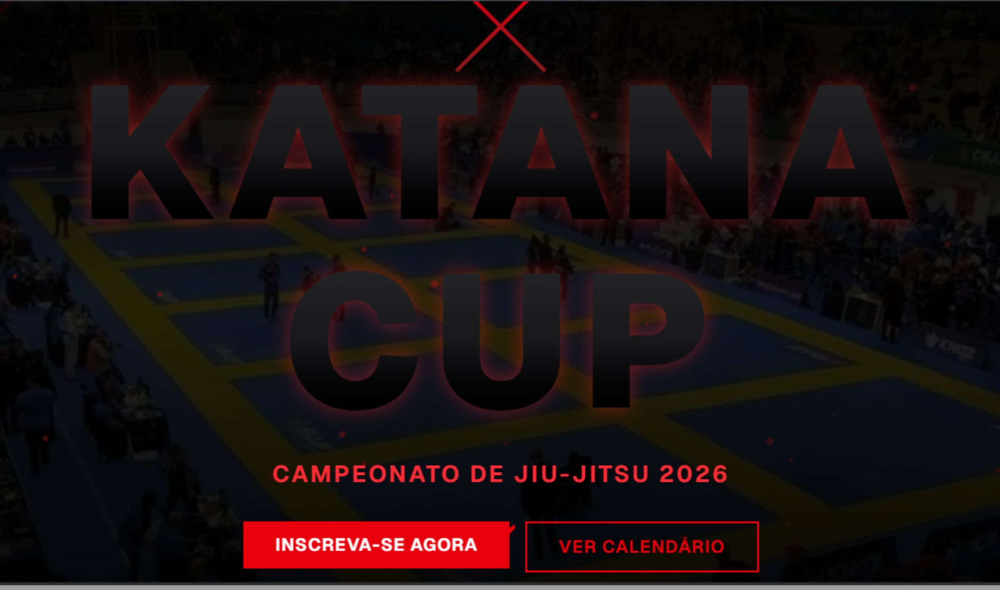

# Katana Cup — Brazilian Jiu-Jitsu Championship

Official website for **Katana Cup**, a Brazilian Jiu-Jitsu championship focused on high-level competition, athlete experience, and professional event presentation.

## Highlights
- Impactful hero section with strong visual identity
- Event-focused information architecture
- Responsive layout (mobile-first)
- Clean typography and clear hierarchy
- Optimized for performance and SEO

## Tech Stack
- Next.js (App Router)
- React
- Tailwind CSS
- Framer Motion
- Lucide Icons


## Getting Started
```bash
npm install
npm run dev
